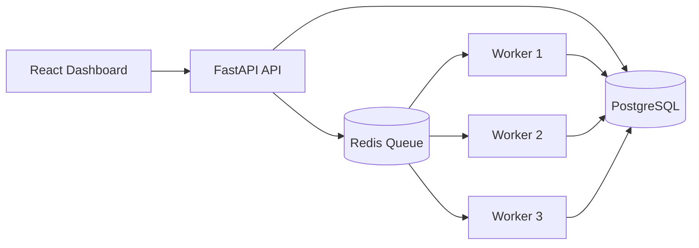

# Cloud Job Queue & Background Processing Platform

A scalable background job processing platform built with **FastAPI, Redis, PostgreSQL, Docker, and React**.

The system accepts asynchronous jobs through a REST API, places them on a Redis-backed queue, processes them with independent worker containers, persists execution state in PostgreSQL, and provides a React dashboard for monitoring jobs in real time.

## Architecture



The worker layer is horizontally scalable. Multiple worker containers consume jobs from the same Redis queue, allowing independent background tasks to run concurrently.

## Features

- REST API for asynchronous job submission
- Redis-backed job queue
- PostgreSQL job persistence
- Background worker processing
- Job lifecycle tracking: queued, processing, completed, and failed
- Automatic retry handling with a maximum of 3 attempts
- Failure/error persistence
- Job payload and result storage
- React monitoring dashboard
- Job detail modal with payload, result, errors, attempts, and timestamps
- Automatic dashboard refresh
- Horizontally scalable workers with Docker Compose
- Concurrent job processing across multiple workers
- Dockerized development environment
- Production React build verified with Vite

## Technology Stack

| Layer | Technology |
|---|---|
| Frontend | React, Vite, Axios, Lucide React |
| API | FastAPI, Python |
| Database | PostgreSQL 17 |
| Queue | Redis 7 |
| Workers | Python |
| Containers | Docker, Docker Compose |
| API Documentation | FastAPI Swagger / OpenAPI |

## Project Structure

```text
cloud-job-queue-platform/
├── api/
│   ├── Dockerfile
│   ├── requirements.txt
│   └── app/
│       └── main.py
├── worker/
│   ├── Dockerfile
│   ├── requirements.txt
│   └── app/
│       └── worker.py
├── database/
│   └── init.sql
├── frontend/
│   ├── src/
│   │   ├── App.jsx
│   │   └── App.css
│   ├── package.json
│   └── vite.config.js
├── docker-compose.yml
├── .env.example
└── .gitignore
```

## Job Lifecycle

```text
Client
  |
  v
POST /jobs
  |
  +--> PostgreSQL: create job
  |
  +--> Redis: enqueue job
          |
          v
       Worker
          |
          +--> processing
          |
          +--> completed
          |
          └--> failed
                |
                +--> retry
                |
                └--> maximum attempts reached
```

## API Endpoints

### Health Check

```http
GET /health
```

Returns the API health status.

### Create Job

```http
POST /jobs
```

Example request:

```json
{
  "job_type": "demo",
  "payload": {
    "message": "Hello from the queue"
  }
}
```

### List Jobs

```http
GET /jobs
```

Returns the latest jobs and their execution states.

### Get Job Details

```http
GET /jobs/{job_id}
```

Returns the complete job record including payload, result, error, attempts, and timestamps.

## Running the Platform

### Prerequisites

- Docker Desktop
- Node.js and npm
- Git

### Start backend services

From the project root:

```powershell
docker compose up -d --build
```

Check the services:

```powershell
docker compose ps
```

The API is available at:

```text
http://localhost:8020
```

Swagger documentation:

```text
http://localhost:8020/docs
```

### Start the React dashboard

Open another terminal:

```powershell
cd frontend
npm install
npm run dev
```

Open:

```text
http://localhost:5173
```

## Horizontal Worker Scaling

The worker service can be scaled without changing the API or Redis queue:

```powershell
docker compose up -d --scale worker=3
```

Verify the workers:

```powershell
docker compose ps
```

This creates multiple worker instances consuming from the same Redis queue.

## Retry Behavior

Jobs can fail and automatically retry up to three attempts.

For testing:

```json
{
  "job_type": "failure-test",
  "payload": {
    "message": "Testing automatic retries"
  }
}
```

The worker records each attempt and stops retrying after the configured maximum.

## Example Monitoring

Worker logs can be viewed with:

```powershell
docker compose logs -f worker
```

The dashboard provides:

- Total jobs
- Queued jobs
- Processing jobs
- Completed jobs
- Failed jobs
- Attempt counts
- Job payloads
- Job results
- Error messages
- Execution timestamps

## Production-Oriented Design

The project demonstrates several patterns used in distributed backend systems:

- **Asynchronous processing** — API requests do not need to perform long-running work directly.
- **Queue-based decoupling** — Redis separates job producers from workers.
- **Horizontal scaling** — additional worker containers can consume the same queue.
- **Persistent state** — PostgreSQL keeps job history and execution results.
- **Retry handling** — transient or test failures can be retried automatically.
- **Containerization** — API, workers, Redis, and PostgreSQL run as independent services.
- **Observability** — job state and worker logs make execution visible.

## Future Improvements

Potential next steps include:

- Exponential retry backoff
- Dead-letter queue
- Job cancellation
- Priority queues
- Scheduled jobs
- Authentication and role-based access
- Queue metrics and throughput monitoring
- Prometheus/Grafana integration
- Distributed tracing
- Kubernetes deployment
- Cloud deployment

## Author

**Rishi Pilla**

Cloud engineering portfolio project focused on distributed systems, backend development, containers, and scalable cloud architecture.
